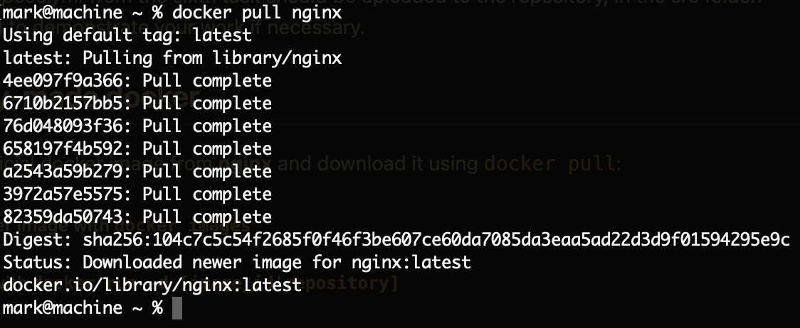
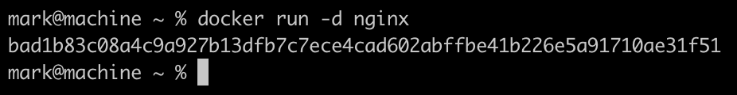
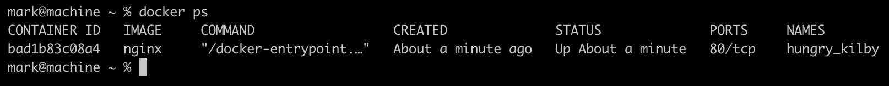
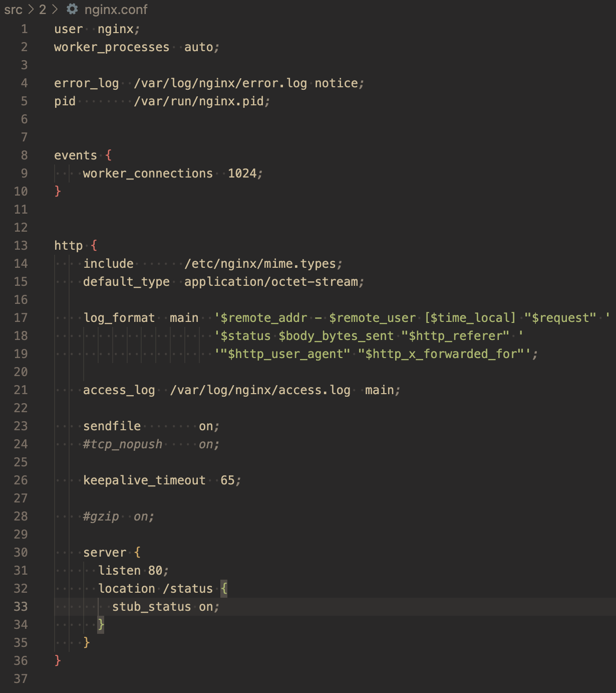
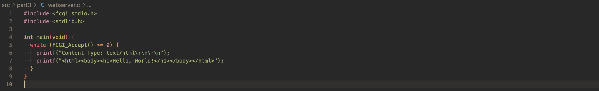
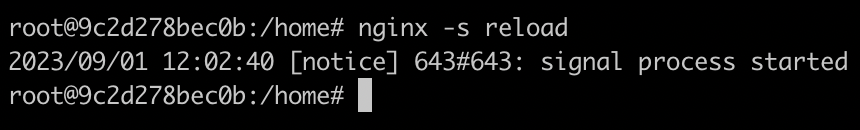
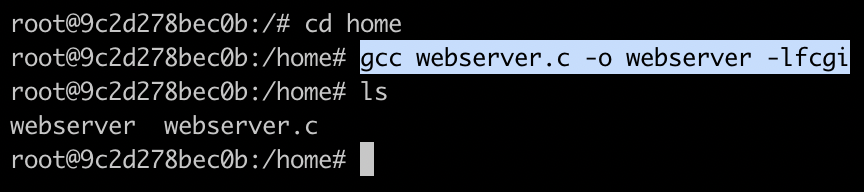
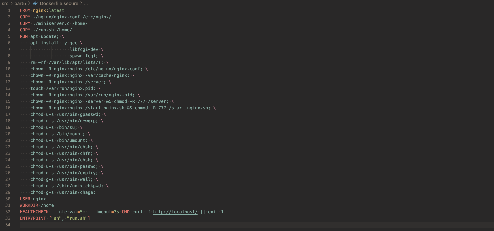

# Simple Docker
1. [Ready-made docker](#part-1-ready-made-docker)
2. [Operations with container](#part-2-operations-with-container)
3. [Mini web server](#part-3-mini-web-server)
4. [Your own docker](#part-4-your-own-docker)
5. [Dockle](#part-5-dockle)
6. [Basic Docker Compose](#part-6-basic-docker-compose)

As a result of the work you should provide a report on the first two tasks. Each part of the task describe what should be added to the report once it has been completed. This can be answers to questions, screenshots, etc.

As a result of the third task you should provide source files for running the web server.

As a result of the fourth and fifth tasks you should provide dockerfiles.

As a result of the sixth task you should provide a *docker-compose.yml* file and the dockerfiles needed to run it (if not provided earlier).

- A report with a .md extension must be uploaded to the repository, in the src folder.
- All parts of the task should be highlighted in the report as level 2 headings.
- Within one part of the task, everything that is added to the report must be in the form of the list.
- Each screenshot in the report must be briefly captioned (what’s in the screenshot).
- All screenshots must be cropped so that only the relevant part of the screen is shown.
- It’s allowed to have several task points shown in one screenshot, but they must all be described in the caption.
- Source files for running the web server from the third task should be uploaded to the repository, in the src/server folder.
- Dockerfiles from the fourth and fifth tasks should be uploaded to the repository, in the src folder.
- *docker-compose.yml* from the sixth task should be uploaded to the repository, in the src folder.
- Be prepared to demonstrate your work if necessary.

## Part 1. Ready-made docker

- Take the official docker image from **nginx** and download it using `docker pull`:
  
- Check for the docker image with `docker images`:
  
- Run docker image with `docker run -d [image_id|repository]`:
  > -d is short for the --detach option. Docker detaches the container process and run it in the background.
  
  
- Check that the image is running with `docker ps`:
  
- View container information with `docker inspect [container_id|container_name]`:
  
- From the command output define and write in the report the container size, list of mapped ports and container ip:
  * container size (in bytes):
    
  * list of mapped ports:
    > Port mapping is used to access the services running inside a Docker container. We open a host port to give us access to a corresponding open port inside the Docker container. Then all the requests that are made to the host port can be redirected into the Docker container.
    **Port mapping makes the processes inside the container available from the outside.**
    
    
  * container ip:
  
- Stop docker image with `docker stop [container_id|container_name]`:
  
- Check that the image has stopped with `docker ps`:
  
- Run docker with ports 80 and 443 in container, mapped to the same ports on the local machine, with *run* command:
  
- Check that the **nginx** start page is available in the browser at *localhost:80*
  
- Restart docker container with `docker restart [container_id|container_name]`:
  
- Check in any way that the container is running:
  


## Part 2. Operations with container

- Read the *nginx.conf* configuration file inside the docker container with the *exec* command:
  
- Create a *nginx.conf* file on a local machine
- Configure it on the */status* path to return the **nginx** server status page:
  
- Copy the created *nginx.conf* file inside the docker image using the `docker cp` command:
  
- Restart **nginx** inside the docker image with *exec*:
  > To reload your configuration, you can stop or restart NGINX, or send signals to the master process. A signal can be sent by running the nginx command (invoking the NGINX executable) with the **-s** argument.
  > **reload** – Reload the configuration file (the SIGHUP signal)

  
- Check that *localhost:80/status* returns the **nginx** server status page:
  
- Export the container to a *container.tar* file with the *export* command:
  > export will fetch the whole container : like a snapshot of a regular VM. Saves the OS of course, but also any change you made, any data file written during the container life. This one is more like a traditional backup.
  > It will give you a flat .tar archive containing the filesystem of your container.

  
- Stop the container:
  
- Delete the image with `docker rmi [image_id|repository]`without removing the container first:
  
- Delete stopped container:
  
- Import the container back using the *import* command:
  > There’s no way to “import a container” (which wouldn’t make sense, as it’s a running environment). As we saw above, export gives us a file system. import takes this file system and imports it as an image, which can run as-is or serve as a layer for other images.

  
- Run the imported container
  > **docker export** does not export everything about the container — just the filesystem. So, when importing the dump back into a new docker image, additional flags need to be specified to recreate the context.
  > For example, the original container of nginx was running fine because the Dockerfile that was used for creating its image had the command `nginx -g daemon off;` in it, so we should use it too
  >> -g directives — set global configuration directives
  
  
- Check that *localhost:80/status* returns the **nginx** server status page:
  


## Part 3. Mini web server

> Back at the dawn of the World Wide Web the first web servers provided pages containing pre-written HTML code. This content could not have been changed, unless its developer had not modified the .html file. Web content used to be static and the available webpage code was passed from the web server to the browser.
>
> With the CGI technology, however, the web server does not respond with an existing HTML file, but executes an application where it transfers the HTTP request data. The application then accepts and processes the arguments as it returns the output data to the web server. Only then the server returns a response to the request while forwarding the generated HTML code.
>
> CGI (Common Gateway Interface) is a web technology and protocol that defines a way for a web server (HTTP server) to interact with external applications. CGI enhances the web server capabilities to enable dynamic content generation and processing.
>
> CGI is used as an interface between the web server and the additionally installed applications generating dynamic web content.
>
> FastCGI is a newer web technology, an improved CGI version as the main functionality remains the same.
>
> <table>
  <tr>
    <th> CGI </th>
    <th> FastCGI </th>
  </tr>
  <tr>
    <td>
      CGI runs an application which works with the requested script for every HTTP request. After the application finishes processing and returns the output data, CGI terminates the application process. Within the next request CGI runs the application.<br>
      <br>
      Every next start might use more time and resources than generating the output data itself.<br>
      <br>
      The more processes are running, the more resources such as RAM or computing power will be exploited. The webpage loading time is now defined not only by the server load, but also from application load time.
    </td>
    <td>
      What makes a difference from CGI is that with FastCGI the running process of the application lasts longer and it is not immediately terminated. After the application finishes processing and returns the output data, the process is not terminated and is being used for processing further requests. This results in reduced server load and less page loading time.<br>
      <br>
      Another difference is that FastCGI can be used on a remote server, a different one from the web server.<br>
      <br>
      The CGI applications main function is to process the HTTP request data and to return a HTTP response. This is the so called “Responder” role in FastCGI. Besides, an application can also perform the roles of Authorizer and Filter.
    </td>
  </tr>
</table>
</blockquote>

- Write a mini server in **C** and **FastCgi** that will return a simple page saying `Hello World!`:
  
- Write your own *nginx.conf* that will proxy all requests from port 81 to *127.0.0.1:8080*:
  
- Run the written mini server via *spawn-fcgi* on port 8080:
  - Run the **nginx** container with the required port mapping:
    
  - Copy the nginx configuration file and the source code of the mini server written in C to the container:
    
  - Reload the **nginx** configuration file:
     
  - Connect to the container's terminal executing an interactive bash shell on the container:
    
  - Install all the required software to build the mini sever inside the container:
    
  - Build the mini server in the docker container:
    
  - Start the mini server app binding it to port 8080:
    > **spawn-fcgi** is used to spawn remote and local FastCGI processes.
    
    
- Check that browser on *localhost:81* returns the page you wrote:
  
- Also we can check that the web server works properly through the **curl** command:
  


## Part 4. Your own docker

- Write your own docker image that:
  1. builds mini server sources on FastCgi from [Part 3](#part-3-mini- web-server)
  2. runs it on port 8080
  3. copies inside the image written *./nginx/nginx.conf*
  4. runs **nginx**.
  > _**nginx** can be installed inside the docker itself, or you can use a ready-made image with **nginx** as base._

  - dockerfile:
  
  - run.sh:
  
- Build the written docker image with `docker build`, specifying the name and tag:
  
- Check with `docker images` that everything is built correctly:
  
- Run the built docker image by mapping port 81 to 80 on the local machine and mapping the *./nginx* folder inside the container to the address where the **nginx** configuration files are located:
  
  > **-it** is short for --interactive + --tty. When you docker run with this command it takes you straight inside the container.
  > **-d** is short for --detach, which means you just run the container and then detach from it. Essentially, you run container in the background.
  > So if you run the Docker container with -itd, it runs both the -it options and detaches you from the container. As a result, your container will still be running in the background even without any default app to run.

- Check that the page of the written mini server is available on localhost:80
  
- Add proxying of */status* page in *./nginx/nginx.conf* to return the **nginx** server status:
  
- Restart docker image:
  
  > *If everything is done correctly, after saving the file and restarting the container, the configuration file inside the docker image should update itself without any extra steps

- Check that *localhost:80/status* now returns a page with **nginx** status:
  


## Part 5. **Dockle**

Once you've written the image, it's never a bad idea to check it for security.

- Check the image from the previous task with `dockle [image_id|repository]`:
  <blockquote>
    for ARM-based Macs the following way of invocation works:

    ```shell
    $ export DOCKLE_LATEST=$(
     curl --silent "https://api.github.com/repos/goodwithtech/dockle/releases/latest" | \
     grep '"tag_name":' | \
     sed -E 's/.*"v([^"]+)".*/\1/' \
    )
    $ docker run --rm -v /var/run/docker.sock:/var/run/docker.sock goodwithtech/dockle:v${DOCKLE_LATEST} [YOUR_IMAGE_NAME]  
    ```
    
  </blockquote>

  
  Dockerfile before the tidying up:
  
- Fix the image so that there are no errors or warnings when checking with **dockle**
  Dockerfile after the tidying up with no **dockle** output errors or warnings or info:
  


## Part 6. Basic **Docker Compose**

Why not try experimenting with deploying a project consisting of several docker images at once?

- Write a *docker-compose.yml* file, using which:
  1. Start the docker container from [Part 5](#part-5-dockle) _(it must work on local network, i.e., you don't need to use **EXPOSE** instruction and map ports to local machine)_:
  2. Start the docker container with **nginx** which will proxy all requests from port 8080 to port 81 of the first container:
  
- Map port 8080 of the second container to port 80 of the local machine:
  
- Stop all running containers:
  
- Build and run the project with the `docker-compose build` and `docker-compose up` commands:
  
- Check that the browser returns the page you wrote on *localhost:80* as before:
  
