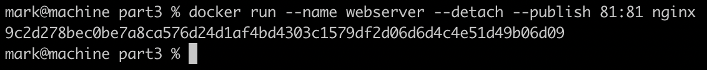
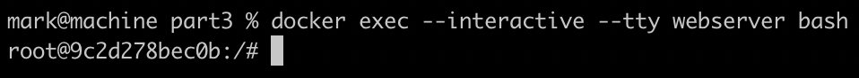
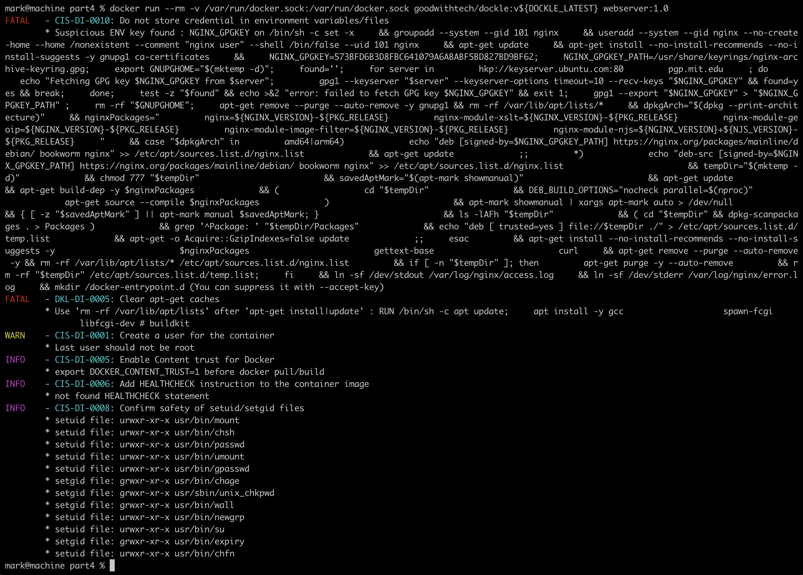
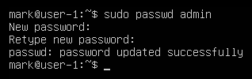
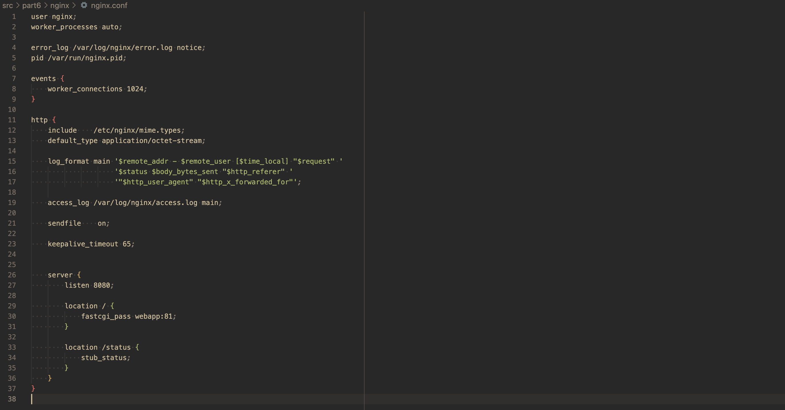
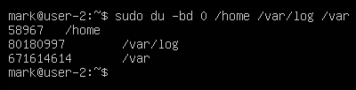

## Part 1. Installation of the OS
An installed system is a good thing, but what if someone else uses it? I'll teach you how to create a new user.

- Ubuntu 20.04 Server LTS was installed.
- Result of running command\
  `cat /etc/issue`\
  that shows OS version:\
  

## Part 2. Creating a user
In our world, you can't go far without the Internet. However, since we want to train you for the role of a system administrator, I'll show you a little more than just setting up a network.
Before we begin, I suggest reading about network interfaces and DHCP.

- Admin user was added with the following command:\
  
- Successful result can be checked with:\
  `cat /etc/passwd`\
  and be seen by it's output on the last line:\
  

## Part 3. Setting up the OS network
Before we begin, I suggest reading about network interfaces and DHCP.

- New machine's hostname was given by a command: \
  `sudo hostnamectl set-hostname <new_name>`\
  and the result can be checked by:\
  `hostnamectl`\
  in the first line of the output:\
  
- New machine's timezone was set by a command:\
  `sudo timedatectl set-timezone <timezone>`\
  and the result can be checked by:\
  `timedatectl`\
  
- To display a list of all network interfaces and the associated ip address typed the following command:\
  `ip addr show`\
  with the result:\
  \
  where lo is a loopback device. You can imagine it as a virtual network device that is on all systems, even if they aren't connected to any network. It has an IP address of 127.0.0.1 and can be used to access network services locally. For example, if you run a webserver on your machine and browse to it with Firefox or Chromium on the same machine, then it will go via this network device.   
- The device's IP address recieved from the DHCP server can be shown by using:\
  `hostname -i`\
  \
  Where DHCP (Dynamic Host Configuration Protocol) is a network management protocol used to dynamically assign an IP address to any device, or node, on a network so it can communicate using IP. DHCP automates and centrally manages these configurations rather than requiring network administrators to manually assign IP addresses to all network devices. DHCP can be implemented on small local networks, as well as large enterprise networks.
- We can define our external ip address of the gateway by using curl in combination with one of the options, e.g.\
  `curl ident.me`\
  as shown below:\
  \
  And before that we can set the curl setting, which will properly adds newline char after any server response, which is not true by default. This can be achieved by using:\
  `echo '-w "\n"' >> ~/.curlrc`\
  Internal ip address of the gateway aka default ip address can be obtained with the command:\
  `ip rout | grep -m 1 default`\
  as shown below:\

- To set static network settings, Netplan is used as the default network management tool for the latest Ubuntu versions. Configuration files for Netplan are written using YAML.\
  \
  In a case if we forgot to open file with sudo edition rights, e.g. using vim, we can pass the following command to save it without reopening:\
  `:w !sudo >/dev/null %`\
  What the command does:
  - :w = Write a file.
  - !sudo = Call shell sudo command.
  - tee = The output of the vi/vim write command is redirected using tee.
  - % = Triggers the use of the current filename.
Simply put, the ‘tee’ command is run as sudo and follows the vi/vim command on the current filename given.
- After the setup we should reboot the system, this can be done with:\
  `sudo reboot`\
  To ensure that the settings were applied, check the previously edited file:\
  \
  and it's all good!
- And as another check we successfuly ping some remote hosts:\
  \
  paying attention to the "0% packet loss" phrase in command output.

## Part 4. OS Update
You're probably wondering, "Is the system ready now?" It's not ready at all! We haven't updated it to the latest version yet.

- To update system packages, firstly we should use:\
  `sudo apt update`\
  the command fetches the latest version of the package list from the distro's software repository,
  only after that we use:\
  `sudo apt upgrade`\
  which actually downloads and installs the updates for each outdated package and dependency on your system.
- The screenshot shows that everything is up to date:\
  

## Part 5. Using the **sudo** command
How often were you told as a child that you forgot to say the "magic" word? One of those "magic" words was "please". Linux has its counterpart – _sudo_. The system won't perform some operations until it hears the "magic" word.

- To check if the user can use sudo command, we can utilize the following command:\
  `sudo -l -U <username>`\
  For now previously created user does not have such right:\
  \
  We can fix that by typing in:\
  `sudo usermod -aG sudo admin`\
  And the result is:\
  \
  ##### The `sudo` utility provides an efficient way to temporarily grant users or user groups privileged access to system resources so that they can run commands that they cannot run under their regular accounts.
- Now we will try to change the OS hostname via the user created previously
  But firstly we need to set it's paswword trhough:\
  `sudo paswwd <username>`\
  The result is shown below:\
  \
  Now we can change the user with the command:\
  `su <username>`\
  as following:\
  \
  checking if the operation proceded successfuly by utilizing:\
  `whoami`\
  and finally we change the hostname by using:\
  `sudo hostnamectl set-hostname <newhostname>`\
  without forgetting to check the result:\
  \

## Part 6. Installing and configuring the time service
Although we have the correct time now, it may not always be that way. To avoid having to set it every time yourself, there are time sync services.

- To set up the automatic time synchronisation service we will use timesync.
  Timesync is the minimalistic service to synchronize local time with NTP servers. The package contains the systemd-timesyncd system service that may be used to synchronize the local system clock with a remote Network Time Protocol server.
  We already have this service installed, but I'll proved the instruction to do it manually just in case:
    - To install the service, execute following command:\
      `apt install systemd-timesyncd`
    - After the installation, service will be started automatically. You can verify it by running the following command:\
      `sudo systemctl status systemd-timesyncd`\
      With the output:\
      
    - To synchronize the Linux system clock with an NTP server using timedatectl, you need to run the following command as root or use sudo:\
      `sudo timedatectl set-ntp true`
- Now we can check if everything's work fine
  Checking the time of the current time zone by\
  `timedatectl`\
  withe the output:\
  \
  or by using:\
  `timedatectl show`\
  wihch shows:\
  \
  The output of the commnad contains `NTPSynchronized=yes`, so we did everything right

## Part 7. Installing and using text editors

- For now we have 3 text editors installed:\
  \
  We will try each of them:
  - Vim:\
    \
    To exit with saving we do the following:
    - `ESC` to exit `INSERT` mode
    - press colon `:` to enter command mode
    - put in `x` to finally give it a command to actually save changes and exit
  - Nano\
    \
    To exit with saving we do the following:
    - press combination `ctrl + X` to enter exit sequence
    - press `y` to confirm that we want to save the changes made
    - write the new name of file with the apllied changes or just press `Enter` to save it to the current file
  - JOE\
    \
    To exit with saving we do the following:
    - press `ctrl + K` to enter command mode
    - follow it by `x` to exit with saving
- Now we will master exiting without saving the changes:
  - Vim:\
    \
    `q!` was typed in a **command mode** to exit
  - Nano:\
    \
    The following sequence was entered: `ctrl + X`, `n`
  - JOE:\
    \
    The following sequence was entered: `crtl + C`, `y`
- Next we will master the functions of searching through the contents of a file (a word) and replacing a word with any other one:
  - Vim:
    - String search:
      Press `/` to toggle search and type in the search query, press `Enter`:\
      
    - String replacement:
      **command mode** type in `s/<pattern>/<pattern_replacement>` to replace one substring with another:\
      
  - Nano:
    - String search: 
      Press `ctrl + W` to toggle search, type in the search query, press `Enter`:\
      
    - String replacement:
      Press `ctrl + \` to toggle replacement command, type in target string, type in replacement string, press `y` to confirm\
      
  - JOE:
    - String search:\
      \
      Press `ctrl + K` + `F` to toggle search command. type in target string, press `Enter` to show the first occurrence
      after that you can hit `ctrl + L` to repeat the previous search to get to the next occurrences
      ##### there is no search highlighting as I know for now
    - String replacement:
      Similar to search, but before pressing `Enter` we can choose replacement option by pressing `r`:\
      
    
## Part 8. Installing and basic setup of the **SSHD** service
It's convenient to have access from one computer to another over a network, isn't it? But to make it not only convenient, but also safe, you should use SSH service.

- Installing of the SSHd service:
  the following command do the work:\
  `apt install openssh-server`\
- To make the service auto-start whenever the system boots type in the following:\
  `sudo systemctl enable --now ssh`\
  as shown below:\
  \
- We will reset the SSHd service to port 2022 by changing the according value at `/etc/ssh/sshd_config`:\
  \
  For changes to take effect we should restart the serice by command:\
  `sudo systemctl restart ssh`\
- To check if everything works as it should, we will type in the following:\
  `ps -Af | grep sshd | head -1`\
  where
  - `-A` selects all the processes
  - `-f` does full-format listing
  - `grep` finds lines that contain specified substring
  - `head -1` shows just the first line of the resulted set of lines
- Reboot the system with:\
  `sudo reboot`
- To check the result we will use `netstat` command
  And if there is no `netstat` command on our system, we should install net-tools:\
  `sudo apt install net-tools`\
  The output of the\
  `netstat -tan`\
  command should contain `tcp 0 0.0.0.0:2022 0.0.0.0:* LISTEN` as follows:\
  \
  Where in command:
  - -t shows only info related to tcp ports.
  - -a shows both listening and non-listening sockets
  - -n shows numerical addresses instead of trying to determine symbolic host (machines' names)
  
  And in output:
  - Proto - The protocol (tcp, udp, udpl, raw) used by the socket.
  - Recv-Q - The count of bytes not copied by the user program connected to this socket.
  - Send-Q - The count of bytes not acknowledged by the remote host.
  - Local Address - Address and port number of the local end of the socket. Unless the --numeric (-n) option is specified, the socket address is resolved to its canonical host name (FQDN), and the port number is translated into the corresponding service name.
  - Foreign Address - Address and port number of the remote end of the socket. Analogous to "Local Address."
  > 0.0.0.0 is a special IP address known as the “default route” or “unspecified address”. It is used to indicate that traffic should be sent to all interfaces on a machine, regardless of their individual IP addresses. 
  - State - The state of the socket. Since there are no states in raw mode and usually no states used in UDP, this column may be left blank
    Normally this can be one of several values:
      - ESTABLISHED - The socket has an established connection. 
      - SYN_SENT - The socket is actively attempting to establish a connection. 
      - SYN_RECV - A connection request has been received from the network. 
      - FIN_WAIT1 - The socket is closed, and the connection is shutting down. 
      - FIN_WAIT2 - Connection is closed, and the socket is waiting for a shutdown from the remote end. 
      - TIME_WAIT - The socket is waiting after close to handle packets still in the network. 
      - CLOSED - The socket is not being used. 
      - CLOSE_WAIT - The remote end has shut down, waiting for the socket to close. 
      - LAST_ACK - The remote end has shut down, and the socket is closed. Waiting for acknowledgement. 
      - LISTEN - The socket is listening for incoming connections. Such sockets are not included in the output unless you specify the --listening (-l) or --all (-a) option. 
      - CLOSING - Both sockets are shut down but we still don't have all our data sent. 
      - UNKNOWN - The state of the socket is unknown.

## Part 9. Installing and using the **top**, **htop** utilities
If I were asked what useful things **top** and **htop** utilities do, I would answer in one word: everything.

- Let's examine the output of `top` command:\
  
  - uptime: 58 min;
  - number of authorised users: 1;
  - total system load: 0,00;
  - total number of processes: 135;
  - cpu load: 0,7 us - user processes;
  - memory load: 187.3 MiB;
  - pid of the process with the highest memory usage: 749
    We can find this out by pressing `Shift + M` to sort processes by memory consumption:\
    
  - pid of the process taking the most CPU time: 1768
    We can find this out by pressing `Shift + P}` to sort processes by CPU utilization:\
    
- Let's examine the output of `htop` command:\
    
    - We can play with sorting by pressing `F6`:
      - sorted by PID:\
      
      - sorted by PERCENT_CPU:\
      
      - sorted by PERCENT_MEM:\
      
      - sorted by TIME:\
      
    - Filter by name with `F4`:\
    
    - Search with `F3`:\
    
    - Additional parameters can be added by pressing `F2`, and after the setup is ready, hit `F10` to save it:\
    

## Part 10. Using the **fdisk** utility
Now let's figure out how to get information about your hard disk. Especially for you I've put together a couple of examples of how to use the fdisk utility.

- To show info regarding the hard disk, run the command:
  `sudo fdisk -l`
  From the output:\
  \
  And particulary:\
  \
  we can deduce:
  - the name of the hard disk: **sda**
  - its capacity: **30 GiB**
  - the number of sectors: **62914560**
  - swap size: **0B**

## Part 11. Using the **df** utility
We got the information about the hard disk, but often it is much more interesting to get information about the disk space, which can be obtained with the df utility.

- From the output of the `df` command:\
  \
  we can get the following info, on the example of the root directory:
  - partition size: **14339080**
  - space used: **2938868**
  - space free: **10650032**
  - percentage used: **22**
  The measurement unit in the report is **K** aka **KiB**.
- The same command but with additional options for file system type and human-readable format outputs:\
  \
  - partition size: **14G**
  - space used: **2.9G**
  - space free: **11G**
  - percentage used **22**
  the file system type for the partition is **ext4**.

## Part 12. Using the **du** utility
df is not the only way to get information about disk space. I'll tell you about another one.

- output of the `du` command:\
  
- It is convenient to check the sizes of directories in bytes with:\
  `sudo du -bd 0 <dirnames>`\
  e.g:\
  \
  and in human-readable format:\
  `sudo du -hd 0 <dirnames>`\
  
- Also we can output the size of all contents of directorie by:\
  `sudo du -h <dirname>/*`\
  as an example:\
  \

## Part 13. Installing and using the **ncdu** utility
You probably didn’t like much the format in which the du command outputs information. I understand you perfectly. So now we'll take a look at its improved version.

- Install the `ncdu` utility with:\
  `sudp apt install ncdu`\
  the examples will be:
  - /home directory:\
  
  - /var directory:\
  
  - /var/log directory:\
  

## Part 14. Working with system logs
A system administrator sometimes needs to review events which happened in a system in the recent past. Linux has system logs for that.

- As examples we will check:
  - `/var/log/dmesg` using Vim:\
  
  - `/var/log/syslog` using Nano:\
  
  - `/var/log/auth.log` using JOE:\
  
- From this screenshot:\
  \
  we can define:
  - last successful login time: **Jul 7 21:06:33**
  - user name: **mark**
  - login method: **LOGIN**
- Now, let's restart SSHd service and try to find service restart message in the logs:
  - restart by:\
  `systemctl restart ssh`
  - check the last lines in the `/var/log/syslog`:\
  \  

## Part 15. Using the **CRON** job scheduler
Phew, we finally got to the last part of my long narrative. I will now show you the program, which, among other things, noticeably simplifies the periodic invocation of other programs.

- Using the job scheduler, we will set to run the `uptime` command in every 2 minutes.
  - to do it safely, run:\
  `cron -e`\
  Where `-e` edits the current crontab (jobs from the current user) using the editor specified by the VISUAL or EDITOR environment variables. After you exit the editor, the modified crontab is installed automatically.
  - type in your task in accordance with the template:\
  
  - in our case it looks like:\
  
- Find lines in the system logs about the execution:\
  
- Display a list of current jobs for CRON by the command:\
  `crontab -l`\
  to display current user's CRON jobs as in the output:\
  
- To remove all tasks from the job scheduler we use:\
  `crontab -r`\
  with the result:\
  \
