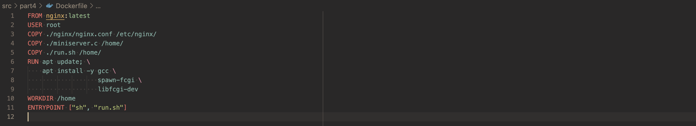
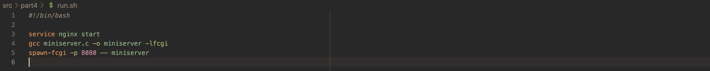

# Linux Network
Linux networks configuration on virtual machines.
## Contents
1. [ipcalc tool](#part-1-ipcalc-tool) 
2. [Static routing between two machines](#part-2-static-routing-between-two-machines) 
3. [iperf3 utility](#part-3-iperf3-utility) 
4. [Network firewall](#part-4-network-firewall) 
5. [Static network routing](#part-5-static-network-routing) 
6. [Dynamic IP configuration using DHCP](#part-6-dynamic-ip-configuration-using-dhcp) 
7. [NAT](#part-7-nat) 
8. [Introduction to SSH Tunnels](#part-8-introduction-to-ssh-tunnels)

## Part 1. **ipcalc** tool
So, let's start our dive into the wonderful world of networks by getting to know IP addresses. And for that we will use **ipcalc** tool.
#### 1.1. Networks and Masks
- Network address of 192.167.38.54/13 &mdash; **192.160.0.0**, can be defined by the command:\
  `ipcalc <ipv4_address[/netmask]>`\
  Output sample for the entry *192.167.38.54/13*:
  ```
  Address:   192.167.38.54        11000000.10100 111.00100110.00110110
  Netmask:   255.248.0.0 = 13     11111111.11111 000.00000000.00000000
  Wildcard:  0.7.255.255          00000000.00000 111.11111111.11111111
  =>
  Network:   192.160.0.0/13       11000000.10100 000.00000000.00000000
  HostMin:   192.160.0.1          11000000.10100 000.00000000.00000001
  HostMax:   192.167.255.254      11000000.10100 111.11111111.11111110
  Broadcast: 192.167.255.255      11000000.10100 111.11111111.11111111
  Hosts/Net: 524286                Class C
  ```
- Conversion of the mask: 
  ```txt
  * 255.255.255.0:
      prefix: 24
      binary: 11111111.11111111.11111111. 00000000
  
  * /15:
      normal: 255.254.0.0
      binary: 11111111.1111111 0.00000000.00000000
  
  * 11111111.11111111.11111111.11110000:
      prefix: 28
      normal: 255.255.255.240
  ```
- Minimum and maximum host in *12.167.38.4* network with masks: 
  ```txt
  Network:   12.0.0.0/8           00001100. 00000000.00000000.00000000
  
  * /8:
  HostMin:   12.0.0.1             00001100. 00000000.00000000.00000001
  HostMax:   12.255.255.254       00001100. 11111111.11111111.11111110
  
  * 11111111.11111111.00000000.00000000
  HostMin:   12.167.0.1           00001100.10100111. 00000000.00000001
  HostMax:   12.167.255.254       00001100.10100111. 11111111.11111110
  
  * 255.255.254.0
  HostMin:   12.167.38.1          00001100.10100111.0010011 0.00000001
  HostMax:   12.167.39.254        00001100.10100111.0010011 1.11111110
  
  * /4:
  HostMin:   0.0.0.1              0000 0000.00000000.00000000.00000001
  HostMax:   15.255.255.254       0000 1111.11111111.11111111.11111110
  ```
#### 1.2. localhost
- There are classifications of IP addresses as "private" and "public". The following ranges of addresses are reserved for private (aka LAN) networks:
  - *10.0.0.0* — *10.255.255.255* (*10.0.0.0/8*),
  - *172.16.0.0* — *172.31.255.255* (*172.16.0.0/12*),
  - *192.168.0.0* — *192.168.255.255* (*192.168.0.0/16*).
  - *127.0.0.0* — *127.255.255.255* (Reserved for loopback interfaces (not used for communication between network nodes), so called localhost)
- So, an application running on localhost can be accessed with examples of the following IPs: 
  - *127.0.0.2*
  - *127.1.0.1*
- And can't be accessed with: 
  - *194.34.23.100*
  - *128.0.0.1*
#### 1.3. Network ranges and segments
- There are examples of the addresses that can be used:
  - only as private: 
    - *10.0.0.45* 
    - *192.168.4.2* 
    - *172.20.250.4* 
    - *172.16.255.255* 
    - *10.10.10.10* 
  - as public and as private:
    - *134.43.0.2* 
    - *172.0.2.1* 
    - *192.172.0.1* 
    - *172.68.0.2* 
    - *192.169.168.1* 
- Examples of possible / not possible gateway IP addresses for *10.10.0.0/18* network: 
  - possible:
    - *10.0.0.1* 
    - *10.10.0.2*
    - *10.10.10.10*
    - *10.10.1.255*
  - not possible:
    - *10.10.100.1*

## Part 2. Static routing between two machines
Now let's figure out how to connect two machines using static routing.
- View existing network interfaces with the `ip a` command:
  - **ws1** and **ws2** have the same output:
    ```
    1: lo: <LOOPBACK,UP,LOWER_UP> mtu 65536 qdisc noqueue state UNKNOWN group default qlen 1000
        link/loopback 00:00:00:00:00:00 brd 00:00:00:00:00:00
        inet 127.0.0.1/8 scope host lo
          valid_lft forever preferred_lft forever
        inet6 ::1/128 scope host 
          valid_lft forever preferred_lft forever
    2: enp0s3: <BROADCAST,MULTICAST,UP,LOWER_UP> mtu 1500 qdisc fq_codel state UP group default qlen 1000
        link/ether 08:00:27:15:61:62 brd ff:ff:ff:ff:ff:ff
        inet 10.0.2.15/24 brd 10.0.2.255 scope global dynamic enp0s3
          valid_lft 86355sec preferred_lft 86355sec
        inet6 fe80::a00:27ff:fe15:6162/64 scope link 
          valid_lft forever preferred_lft forever
    3: enp0s8: <BROADCAST,MULTICAST> mtu 1500 qdisc noop state DOWN group default qlen 1000
        link/ether 08:00:27:cf:50:d0 brd ff:ff:ff:ff:ff:ff
    ```
- Description of the network interfaces corrsesponding to the internal network on both machines:
  - lo: loopback interface
  - enp0s3: Ethernet interface, PCI location 0, hot plug slot 3
- Set the following addresses and masks: 
  - ws1 - *192.168.100.10*, mask */16*:
    ```yaml
    network:
      ethernets:
        enp0s3:
          dhcp4: true
        enp0s8:
          dhcp4: false
          addresses: [192.168.100.10/16]
      version: 2
    ```
  - ws2 - *172.24.116.8*, mask */12*:
    ```yaml
    network:
      ethernets:
        enp0s3:
          dhcp4: true
        enp0s8:
          dhcp4: false
          addresses: [172.24.116.8/12]
      version: 2    
    ```
- Run the `netplan apply` command to restart the network service.
  There should be no errors.
#### 2.1. Adding a static route manually
- Add a static route from one machine to another and back via:
  `ip r add <ip_address> via <gateway> dev <interface>`
- Ping the connection between the machines
  - ws1:
    ```txt
    mark@ws1:~$ netstat -rn
    Kernel IP routing table
    Destination     Gateway         Genmask         Flags   MSS Window  irtt Iface
    0.0.0.0         10.0.2.2        0.0.0.0         UG        0 0          0 enp0s3
    10.0.2.0        0.0.0.0         255.255.255.0   U         0 0          0 enp0s3
    10.0.2.2        0.0.0.0         255.255.255.255 UH        0 0          0 enp0s3
    192.168.0.0     0.0.0.0         255.255.0.0     U         0 0          0 enp0s8
    
    mark@ws1:~$ sudo ip route add 172.24.116.8 via 192.168.100.10 dev enp0s8
    mark@ws1:~$ netstat -rn
    Kernel IP routing table
    Destination     Gateway         Genmask         Flags   MSS Window  irtt Iface
    0.0.0.0         10.0.2.2        0.0.0.0         UG        0 0          0 enp0s3
    10.0.2.0        0.0.0.0         255.255.255.0   U         0 0          0 enp0s3
    10.0.2.2        0.0.0.0         255.255.255.255 UH        0 0          0 enp0s3
    172.24.116.8    192.168.100.10  255.255.255.255 UGH       0 0          0 enp0s8
    192.168.0.0     0.0.0.0         255.255.0.0     U         0 0          0 enp0s8
    
    mark@ws1:~$ ping -c 3 172.24.116.8
    PING 172.24.116.8 (172.24.116.8) 56(84) bytes of data.
    64 bytes from 172.24.116.8: icmp_seq=1 ttl=64 time=0.989 ms
    64 bytes from 172.24.116.8: icmp_seq=2 ttl=64 time=1.11 ms
    64 bytes from 172.24.116.8: icmp_seq=3 ttl=64 time=1.16 ms
    
    --- 172.24.116.8 ping statistics ---
    3 packets transmitted, 3 received, 0% packet loss, time 2012ms
    rtt min/avg/max/mdev = 0.989/1.083/1.155/0.069 ms
    ```
  - ws2:
    ```txt
    mark@ws2:~$ netstat -rn
    Kernel IP routing table
    Destination     Gateway         Genmask         Flags   MSS Window  irtt Iface
    0.0.0.0         10.0.2.2        0.0.0.0         UG        0 0          0 enp0s3
    10.0.2.0        0.0.0.0         255.255.255.0   U         0 0          0 enp0s3
    10.0.2.2        0.0.0.0         255.255.255.255 UH        0 0          0 enp0s3
    172.16.0.0      0.0.0.0         255.240.0.0     U         0 0          0 enp0s8
    
    mark@ws2:~$ sudo ip route add 192.168.100.10 via 172.24.116.8 dev enp0s8
    mark@ws2:~$ netstat -rn
    Kernel IP routing table
    Destination     Gateway         Genmask         Flags   MSS Window  irtt Iface
    0.0.0.0         10.0.2.2        0.0.0.0         UG        0 0          0 enp0s3
    10.0.2.0        0.0.0.0         255.255.255.0   U         0 0          0 enp0s3
    10.0.2.2        0.0.0.0         255.255.255.255 UH        0 0          0 enp0s3
    172.16.0.0      0.0.0.0         255.240.0.0     U         0 0          0 enp0s8
    192.168.100.10  172.24.116.8    255.255.255.255 UGH       0 0          0 enp0s8
    
    mark@ws2:~$ ping -c 3 192.168.100.10
    PING 192.168.100.10 (192.168.100.10) 56(84) bytes of data.
    64 bytes from 192.168.100.10: icmp_seq=1 ttl=64 time=1.06 ms
    64 bytes from 192.168.100.10: icmp_seq=2 ttl=64 time=1.00 ms
    64 bytes from 192.168.100.10: icmp_seq=3 ttl=64 time=1.14 ms
    
    --- 192.168.100.10 ping statistics ---
    3 packets transmitted, 3 received, 0% packet loss, time 2017ms
    rtt min/avg/max/mdev = 1.001/1.068/1.141/0.057 ms
    ```
But connection created by this command will disappear after network or system restart.
#### 2.2. Adding a static route with saving
- To do a clean experiment, restart the machines
- Adding static route from one machine to another using *etc/netplan/00-installer-config.yaml* file
  - ws1:
    ```yaml
    network:
      ethernets:
        enp0s3:
          dhcp4: true
        enp0s8:
          dhcp4: false
          addresses: [192.168.100.10/16]
          routes:
            - to:  172.24.116.8
              via: 192.168.100.10
      version: 2
    ```
  - ws2:
    ```yaml
    network:
      ethernets:
        enp0s3:
          dhcp4: true
        enp0s8:
          dhcp4: false
          addresses: [172.24.116.8/12]
          routes:
            - to:  192.168.100.10
              via: 172.24.116.8
      version: 2 
    ```
- Ping the connection between the machines
  - ws1:
    ```txt
    mark@ws1:~$ sudo vim /etc/netplan/00-installer-config.yaml 
    mark@ws1:~$ sudo netplan apply
    mark@ws1:~$ ping -c 3 172.24.116.8
    PING 172.24.116.8 (172.24.116.8) 56(84) bytes of data.
    64 bytes from 172.24.116.8: icmp_seq=1 ttl=64 time=2.44 ms
    64 bytes from 172.24.116.8: icmp_seq=2 ttl=64 time=1.16 ms
    64 bytes from 172.24.116.8: icmp_seq=3 ttl=64 time=0.465 ms
    
    --- 172.24.116.8 ping statistics ---
    3 packets transmitted, 3 received, 0% packet loss, time 2004ms
    rtt min/avg/max/mdev = 0.465/1.353/2.436/0.816 ms
    ```
  - ws2:
    ```txt
    mark@ws2:~$ sudo vim /etc/netplan/00-installer-config.yaml 
    mark@ws2:~$ sudo netplan apply
    mark@ws2:~$ ping -c 3 192.168.100.10
    PING 192.168.100.10 (192.168.100.10) 56(84) bytes of data.
    64 bytes from 192.168.100.10: icmp_seq=1 ttl=64 time=1.97 ms
    64 bytes from 192.168.100.10: icmp_seq=2 ttl=64 time=1.08 ms
    64 bytes from 192.168.100.10: icmp_seq=3 ttl=64 time=1.07 ms

    --- 192.168.100.10 ping statistics ---
    3 packets transmitted, 3 received, 0% packet loss, time 2100ms
    rtt min/avg/max/mdev = 1.067/1.372/1.966/0.420 ms
    ```

## Part 3. **iperf3** utility
The most important thing about transferring information between machines is the connection speed. 
We’ll check it with **iperf3** utility.
#### 3.1. Connection speed
- Conversion samples: 
  - 8 Mbps to MB/s: 8 Mbps/ 8 = **1 MB/s**
  - 100 MB/s to Kbps: 100 MB/s * 1000 * 8 = **800000 Kbps**
  - 1 Gbps to Mbps: 1 Gbps * 1000 = **1000 Mbps**

#### 3.2. **iperf3** utility
- Measure connection speed between ws1 and ws2
  The iperf3 executable contains both client and server functionality. 
  So, we have to establish connection between a machine that we define as a server and another one which we define as a client
  - **ws1** we choose as a server, which is indicated by passing the `-s` parameter:
    `iperf3 -s -f <unit_of_measure_for_speed>`
    ```txt
    mark@ws1:~$ iperf3 -s -f M
    -----------------------------------------------------------
    Server listening on 5201
    -----------------------------------------------------------
    ```
  - **ws2**, a client:
    `iperf3 -c <ip_address_of_the_server>`
    ```txt
    mark@ws2:~$ iperf3 -c 192.168.100.10
    Connecting to host 192.168.100.10, port 5201
    [  5] local 172.24.116.8 port 59606 connected to 192.168.100.10 port 5201
    [ ID] Interval           Transfer     Bitrate         Retr  Cwnd
    [  5]   0.00-1.00   sec   398 MBytes  3.33 Gbits/sec  2250    177 KBytes       
    [  5]   1.00-2.00   sec   431 MBytes  3.63 Gbits/sec  2494    191 KBytes       
    [  5]   2.00-3.00   sec   418 MBytes  3.50 Gbits/sec  2881    187 KBytes       
    [  5]   3.00-4.00   sec   421 MBytes  3.53 Gbits/sec  2250    182 KBytes       
    [  5]   4.00-5.00   sec   448 MBytes  3.76 Gbits/sec  2960    230 KBytes       
    [  5]   5.00-6.00   sec   463 MBytes  3.89 Gbits/sec  3193    222 KBytes       
    [  5]   6.00-7.00   sec   430 MBytes  3.61 Gbits/sec  3068    191 KBytes       
    [  5]   7.00-8.00   sec   455 MBytes  3.81 Gbits/sec  3150    215 KBytes       
    [  5]   8.00-9.00   sec   410 MBytes  3.44 Gbits/sec  2033    221 KBytes       
    [  5]   9.00-10.00  sec   398 MBytes  3.33 Gbits/sec  2312    177 KBytes       
    - - - - - - - - - - - - - - - - - - - - - - - - -
    [ ID] Interval           Transfer     Bitrate         Retr
    [  5]   0.00-10.00  sec  4.17 GBytes  3.58 Gbits/sec  26591             sender
    [  5]   0.00-10.00  sec  4.17 GBytes  3.58 Gbits/sec                  receiver
    
    iperf Done.
    ```
  - ws1:
    ```txt
    Accepted connection from 172.24.116.8, port 59594
    [  5] local 192.168.100.10 port 5201 connected to 172.24.116.8 port 59606
    [ ID] Interval           Transfer     Bitrate
    [  5]   0.00-1.00   sec   396 MBytes   396 MBytes/sec                  
    [  5]   1.00-2.00   sec   431 MBytes   431 MBytes/sec                  
    [  5]   2.00-3.00   sec   417 MBytes   417 MBytes/sec                  
    [  5]   3.00-4.00   sec   421 MBytes   421 MBytes/sec                  
    [  5]   4.00-5.00   sec   449 MBytes   449 MBytes/sec                  
    [  5]   5.00-6.00   sec   462 MBytes   462 MBytes/sec                  
    [  5]   6.00-7.00   sec   431 MBytes   431 MBytes/sec                  
    [  5]   7.00-8.00   sec   454 MBytes   454 MBytes/sec                  
    [  5]   8.00-9.00   sec   410 MBytes   410 MBytes/sec                  
    [  5]   9.00-10.00  sec   398 MBytes   398 MBytes/sec                  
    - - - - - - - - - - - - - - - - - - - - - - - - -
    [ ID] Interval           Transfer     Bitrate
    [  5]   0.00-10.00  sec  4.17 GBytes   427 MBytes/sec                  receiver
    -----------------------------------------------------------
    Server listening on 5201
    -----------------------------------------------------------
    ```

## Part 4. Network firewall
After connecting the machines, the next our task is to control the information flowing over the connection. For that we use firewalls.
#### 4.1. **iptables** utility
##### Create a */etc/firewall.sh* file simulating the firewall on ws1 and ws2:
```shell
#!/bin/sh

# Deleting all the rules in the "filter" table (default).
iptables -F
iptables -X
```
- We add the following rules:
  - Open access on the machines for port 22 (ssh) and port 80 (http):
    ```
    iptables -A INPUT -p tcp --dport ssh  -j ACCEPT
    iptables -A INPUT -p tcp --dport http -j ACCEPT
    ```
  - Allow *echo reply* :
    `iptables -A OUTPUT -p icmp --icmp-type echo-reply -j ACCEPT`
  - Reject *echo reply* :
    `iptables -A OUTPUT -p icmp --icmp-type echo-reply -j REJECT`

    > On **ws1** we will set the rules in a such way that the deny rule comes before the allow, on **ws2** &mdash; vice versa.
- There should be no errors after running the script:
  - 
  - 
- If a rule does match the packet, the rule takes the action indicated by the target, which may result in the packet being allowed to continue along the chain or not. On **ws1** first rule breaks the chain, on **ws2** &mdash; not.
#### 4.2. **nmap** utility
- So, the first machine can't be pinged, but at the same time, by using, **nmap** utility we can show that the machine host is up
  ```
  mark@ws2:~$ nmap 192.168.100.10
  Starting Nmap 7.80 ( https://nmap.org ) at 2023-07-11 03:26 +07
  Nmap scan report for 192.168.100.10
  Host is up (0.00035s latency).
  Not shown: 999 closed ports
  PORT   STATE SERVICE
  22/tcp open  ssh
  
  Nmap done: 1 IP address (1 host up) scanned in 0.08 seconds
  mark@ws2:~$ ping 192.168.100.10
  PING 192.168.100.10 (192.168.100.10) 56(84) bytes of data.
  
  --- 192.168.100.10 ping statistics ---
  10 packets transmitted, 0 received, 100% packet loss, time 9266ms
  ```
- Save dumps of the virtual machine images

## Part 5. Static network routing
So far we have only connected two machines, but now it's time for static routing of the whole network.
We will be configuring a network according to the picture:


VM internal network setup will look like this:
| LAN | hosts which are local to LAN |
| --- | ---------------------------- |
| r1p | ws11, r1                     |
| rsh | r1, r2                       |
| r2p | ws21, ws22, r2               |

where **p** stands for *private* and **sh** for *shared*
- Start five virtual machines (3 workstations (ws11, ws21, ws22) and 2 routers (r1, r2))
- Add to them additional network adapters attached to internal network, while leaving the one already existing as NAT to be able to connect to the machines through ssh so that we are not limited to VM VB terminal possibilites
- For the convenience we can set IP-hostname mapping in */etc/hosts* file for each of the host machines:
  - ws11:
    ```
    10.20.0.10  ws21
    10.20.0.20  ws22
    10.100.0.12 r2
    10.10.0.01  r1
    ```
  - ws21:
    ```
    10.10.0.2   ws11
    10.20.0.20  ws22
    10.20.0.1   r2
    10.100.0.11 r1
    ```
  - ws22:
    ```
    10.10.0.2   ws11
    10.20.0.10  ws21
    10.20.0.1   r2
    10.100.0.11 r1
    ```
  - r1:
    ```
    10.10.0.2   ws11
    10.20.0.10  ws21
    10.20.0.20  ws22
    10.100.0.12 r2
    ```
  - r2:
    ```
    10.10.0.2   ws11
    10.20.0.10  ws21
    10.20.0.20  ws22
    10.100.0.11 r1
    ```
#### 5.1. Configuration of machine addresses
- Set up the machine configurations in *etc/netplan/00-installer-config.yaml* according to the network in the picture.
  - ws11:  
    ```yaml
    network:
      version: 2
      ethernets:
        enp0s3:
          dhcp4: true
        enp0s8:
          match:
            macaddress: 08:00:27:00:b7:a9
          set-name: eth0
          addresses: [10.10.0.2/18]
    ```
  - ws21:
    ```yaml
    network:
      version: 2 
      ethernets:
        enp0s3:
          dhcp4: true
        enp0s8:
          match:
            macaddress: 08:00:27:cf:50:d0
          set-name: eth0
          addresses: [10.20.0.20/26]
    ```
  - ws22:
    ```yaml
    network:
      version: 2
      ethernets:
        enp0s3:
          dhcp4: true
        enp0s8:
          match:
            macaddress: 08:00:27:32:97:cf  
          set-name: eth0
          addresses: [10.20.0.10/26]
    ```
  - r1:
    ```yaml
    network:
      version: 2
      ethernets:
        enp0s3:
          dhcp4: true
        enp0s8:
          match:
            macaddress: 08:00:27:01:5f:9a
          set-name: eth0
          addresses: [10.10.0.1/18]
        enp0s9:
          match:
            macaddress: 08:00:27:73:bc:91
          set-name: eth1
          addresses: [10.100.0.11/16]
    ```
  - r2:
    ```yaml
    network:
      version: 2
      ethernets:
        enp0s3:
          dhcp4: true
        enp0s8:
          match:
            macaddress: 08:00:27:b5:31:09
          set-name: eth0 
          addresses: [10.100.0.12/16]
        enp0s9:
          match:
            macaddress: 08:00:27:94:7c:34 
          set-name: eth1
            addresses: [10.20.0.1/26]
      
    ```
- Check that there is no errors:
  - Restart the network service. 
  - If there are no errors, check that the machine address is correct with the `ip a | grep <inteface>` command:
    - ws11:
      ```
      mark@ws11:~$ ip a | grep eth0
      3: eth0: <BROADCAST,MULTICAST,UP,LOWER_UP> mtu 1500 qdisc fq_codel state UP group default qlen 1000
          inet 10.10.0.2/18 brd 10.10.63.255 scope global eth0
      ```
    - ws21:
      ```
      mark@ws21:~$ ip a | grep eth0
      3: eth0: <BROADCAST,MULTICAST,UP,LOWER_UP> mtu 1500 qdisc fq_codel state UP group default qlen 1000
          inet 10.20.0.10/26 brd 10.20.0.63 scope global eth0
      ```
    - ws22:
      ```
      mark@ws22:~$ ip a | grep eth0
      3: eth0: <BROADCAST,MULTICAST,UP,LOWER_UP> mtu 1500 qdisc fq_codel state UP group default qlen 1000
          inet 10.20.0.20/26 brd 10.20.0.63 scope global eth0
      ```
    - r1:
      ```
      mark@r1:~$ ip a | grep 'eth[0,1]'
      3: eth0: <BROADCAST,MULTICAST,UP,LOWER_UP> mtu 1500 qdisc fq_codel state UP group default qlen 1000
          inet 10.10.0.1/18 brd 10.10.63.255 scope global eth0
      4: eth1: <BROADCAST,MULTICAST,UP,LOWER_UP> mtu 1500 qdisc fq_codel state UP group default qlen 1000
          inet 10.100.0.11/16 brd 10.100.255.255 scope global eth1
      ```
    - r2:
      ```
      mark@r2:~$ ip a | grep 'eth[0,1]'
      3: eth0: <BROADCAST,MULTICAST,UP,LOWER_UP> mtu 1500 qdisc fq_codel state UP group default qlen 1000
          inet 10.100.0.12/16 brd 10.100.255.255 scope global eth0
      4: eth1: <BROADCAST,MULTICAST,UP,LOWER_UP> mtu 1500 qdisc fq_codel state UP group default qlen 1000
          inet 10.20.0.1/26 brd 10.20.0.63 scope global eth1
      ```
  - Ping **ws22** from **ws21**:
    ```txt
    mark@ws21:~$ ping -c3 ws22
    PING ws22 (10.20.0.20) 56(84) bytes of data.
    64 bytes from ws22 (10.20.0.20): icmp_seq=1 ttl=64 time=1.91 ms
    64 bytes from ws22 (10.20.0.20): icmp_seq=2 ttl=64 time=0.618 ms
    64 bytes from ws22 (10.20.0.20): icmp_seq=3 ttl=64 time=1.09 ms
    
    --- ws22 ping statistics ---
    3 packets transmitted, 3 received, 0% packet loss, time 2019ms
    rtt min/avg/max/mdev = 0.618/1.204/1.906/0.532 ms
    ```
  - Ping **r1** from **ws11**:
    ```txt
    mark@ws11:~$ ping -c3 r1
    PING r1 (10.10.0.1) 56(84) bytes of data.
    64 bytes from r1 (10.10.0.1): icmp_seq=1 ttl=64 time=1.21 ms
    64 bytes from r1 (10.10.0.1): icmp_seq=2 ttl=64 time=1.32 ms
    64 bytes from r1 (10.10.0.1): icmp_seq=3 ttl=64 time=1.31 ms
    
    --- r1 ping statistics ---
    3 packets transmitted, 3 received, 0% packet loss, time 2125ms
    rtt min/avg/max/mdev = 1.208/1.279/1.320/0.050 ms
    ```
#### 5.2. Enabling IP forwarding.
- To check whether IP forwarding is turned on or off, run the following command:\
  `sysctl net.ipv4.ip_forward`
- To enable IP forwarding temporarily, run the following command on the routers:\
  `sysctl -w net.ipv4.ip_forward=1`.
  *With this approach, the forwarding will not work after the system is rebooted.*
  - r1:
    ```
    mark@r1:~$ sudo sysctl -w net.ipv4.ip_forward=1
    net.ipv4.ip_forward = 1
    ```
  - r2:
    ```
    mark@r2:~$ sudo sysctl -w net.ipv4.ip_forward=1
    net.ipv4.ip_forward = 1
    ```
- To enable IP forwarding permanently, open */etc/sysctl.conf* file and uncomment the following line iside it:\
  `# net.ipv4.ip_forward=1`
#### 5.3. Default route configuration
- Configure the default route (gateway) for the workstations. To do this, add `default` before the router's IP to the interface at the end of the configuration file:
  - ws11:
    ```yaml
    ---x---
          routes:
            - to:  default
              via: 10.10.0.1
    ```
  - ws21:
    ```yaml
    ---x---
          routes:
            - to:  default
              via: 10.20.0.1
    ```
  - ws22:
    ```yaml
    ---x---
          routes:
            - to:  default
              via: 10.20.0.1
    ```
- Call `ip r | grep eth0` and check that a route is added to the routing table:
  - ws11:
    ```
    default via 10.10.0.1 dev eth0 proto static 
    10.10.0.0/18 dev eth0 proto kernel scope link src 10.10.0.2
    ```
  - ws21:
    ```
    default via 10.20.0.1 dev eth0 proto static 
    10.20.0.0/26 dev eth0 proto kernel scope link src 10.20.0.10 
    ```
  - ws22:
    ```
    default via 10.20.0.1 dev eth0 proto static 
    10.20.0.0/26 dev eth0 proto kernel scope link src 10.20.0.20 
    ```
- Ping r2 router from ws11 and show on r2 that the ping is reaching. To do this, use the `tcpdump ip -tn -i r2` command
> ip  prints only IPv4 packets\
> -t  don't print a timestamp on each dump line.\
> -n  don't convert addresses (i.e., host addresses, port numbers,  etc.) to names.     
  - ws1:
    ```
    mark@ws11:~$ ping -c3 r2
    PING r2 (10.100.0.12) 56(84) bytes of data.

    --- r2 ping statistics ---
    3 packets transmitted, 0 received, 100% packet loss, time 2034ms

    ```
  - r2:
    ```
    mark@r2:~$ sudo tcpdump -tn -i eth0 ip
    tcpdump: verbose output suppressed, use -v or -vv for full protocol decode
    listening on eth0, link-type EN10MB (Ethernet), capture size 262144 bytes
    IP 10.10.0.2 > 10.100.0.12: ICMP echo request, id 31, seq 1, length 64
    IP 10.10.0.2 > 10.100.0.12: ICMP echo request, id 31, seq 2, length 64
    IP 10.10.0.2 > 10.100.0.12: ICMP echo request, id 31, seq 3, length 64
    ^C
    3 packets captured
    3 packets received by filter
    0 packets dropped by kernel
    ```
#### 5.4. Adding static routes
- Add static routes to r1 and r2 in configuration file:
  - r1 to *eth1*:
    ```yaml
    ---x---
          routes:
            - to:  10.20.0.0
              via: 10.100.0.12
    ```
  - r2 to *eth0*:
    ```yaml
    ---x---
          routes:
            - to:  10.10.0.0
              via: 10.100.0.11
    ```
- Call `ip r` and show route tables on both routers:
  - r1:
    ```
    mark@r1:~$ ip r | grep eth
    10.10.0.0/18 dev eth0 proto kernel scope link src 10.10.0.1 
    10.20.0.0 via 10.100.0.12 dev eth1 proto static 
    10.100.0.0/16 dev eth1 proto kernel scope link src 10.100.0.11 
    ```
  - r2:
    ```
    mark@r2:~$ ip r | grep eth
    10.10.0.0 via 10.100.0.11 dev eth0 proto static 
    10.20.0.0/26 dev eth1 proto kernel scope link src 10.20.0.1 
    10.100.0.0/16 dev eth0 proto kernel scope link src 10.100.0.12 
    ```
- Run `ip r list 10.10.0.0/[netmask]` and `ip r list 0.0.0.0/0` commands on ws11:
  ```
  mark@ws11:~$ ip r list 10.10.0.0/18
  10.10.0.0/18 dev eth0 proto kernel scope link src 10.10.0.2 
  
  mark@ws11:~$ ip r list 0.0.0.0/0 | grep eth
  default via 10.10.0.1 dev eth0 proto static 
  ```
- If a packet is received on a routing device, the device first checks to see if the IP destination address is on one of the device’s local subnets. If the destination address is not local, the packet is forwarded to the next hop toward the destination using the default route(0.0.0.0).
In our case the subnet 10.10.0.0/0 is local for our device, so device selects the route that was installed by the kernel during autoconfiguration &mdash; through the statically set ip address of our network interface.
#### 5.5. Making a router list
- Run the `sudo tcpdump -tnv -i eth0` dump command on r1
- Use **traceroute** utility to list routers in the path from ws11 to ws21:
  - ws1:
    ```
    mark@ws11:~$ traceroute ws22
    traceroute to ws22 (10.20.0.20), 30 hops max, 60 byte packets
     1  r1 (10.10.0.1)  0.484 ms  0.454 ms  0.436 ms
     2  r2 (10.100.0.12)  0.948 ms  0.935 ms  0.918 ms
     3  ws22 (10.20.0.20)  1.002 ms  0.984 ms  0.968 ms
    ```
  - r1:
    ```
    mark@r1:~$ sudo tcpdump -tnv -i eth0
    tcpdump: listening on eth0, link-type EN10MB (Ethernet), capture size 262144 bytes
    IP (tos 0x0, ttl 1, id 25199, offset 0, flags [none], proto UDP (17), length 60)
        10.10.0.2.39586 > 10.20.0.20.33434: UDP, length 32
    IP (tos 0xc0, ttl 64, id 823, offset 0, flags [none], proto ICMP (1), length 88)
        10.10.0.1 > 10.10.0.2: ICMP time exceeded in-transit, length 68
    	IP (tos 0x0, ttl 1, id 25199, offset 0, flags [none], proto UDP (17), length 60)
        10.10.0.2.39586 > 10.20.0.20.33434: UDP, length 32
    IP (tos 0x0, ttl 1, id 62707, offset 0, flags [none], proto UDP (17), length 60)
        10.10.0.2.44720 > 10.20.0.20.33435: UDP, length 32
    IP (tos 0x0, ttl 1, id 10965, offset 0, flags [none], proto UDP (17), length 60)
        10.10.0.2.50716 > 10.20.0.20.33436: UDP, length 32
    IP (tos 0x0, ttl 2, id 13456, offset 0, flags [none], proto UDP (17), length 60)
        10.10.0.2.36903 > 10.20.0.20.33437: UDP, length 32
    IP (tos 0x0, ttl 2, id 56223, offset 0, flags [none], proto UDP (17), length 60)
        10.10.0.2.32985 > 10.20.0.20.33438: UDP, length 32
    IP (tos 0xc0, ttl 64, id 824, offset 0, flags [none], proto ICMP (1), length 88)
        10.10.0.1 > 10.10.0.2: ICMP time exceeded in-transit, length 68
    	IP (tos 0x0, ttl 1, id 62707, offset 0, flags [none], proto UDP (17), length 60)
        10.10.0.2.44720 > 10.20.0.20.33435: UDP, length 32
    ...

    32 packets captured
    32 packets received by filter
    0 packets dropped by kernel
    ```
Traceroute is a network diagnostic tool used to determine the path taken by packets from a source to a destination. It works by sending packets with gradually increasing Time to Live (TTL) values and examining the ICMP (Internet Control Message Protocol) Time Exceeded responses received from intermediate routers. Here's a simplified explanation of how path construction works in traceroute:

1. When you run the traceroute command with a destination IP address or domain name, it starts by sending packets with a TTL value of 1.
2. The first packet with a TTL of 1 reaches the first hop (the first router in the path) and gets its TTL decremented to 0. Since the TTL reaches zero, the router discards the packet and sends an ICMP Time Exceeded message back to the source.
3. The source receives the ICMP Time Exceeded message and notes the IP address of the router that sent it. This IP address represents the first hop in the path.
4. Traceroute then sends another packet with a TTL value of 2. This packet reaches the first hop successfully but expires at the second hop, generating another ICMP Time Exceeded message.
5. This process continues, with the TTL value increasing by one for each subsequent packet, until the destination is reached or a maximum number of hops is reached (often 30 hops).
6. Each intermediate router in the path decrements the TTL value by one, and the source records the IP addresses of the routers that generate the ICMP Time Exceeded messages. These IP addresses represent the successive hops in the path.
7. Traceroute repeats this process multiple times to gather more accurate data and measure the round-trip time (RTT) for each hop.
8. Finally, traceroute presents the collected information, including the IP addresses of the routers and the RTT for each hop, in a formatted output that illustrates the path taken by the packets from the source to the destination.

#### 5.6. Using **ICMP** protocol in routing
- Run on r1 network traffic capture going through eth0 with the `sudo tcpdump -n -i eth0 icmp` command.
- Ping a non-existent IP (e.g. *10.30.0.111*) from ws11 with the `ping -c 1 10.30.0.111` command:
  - ws11:
    ```
    mark@ws11:~$ ping -c 1 10.30.0.111
    PING 10.30.0.111 (10.30.0.111) 56(84) bytes of data.
    
    --- 10.30.0.111 ping statistics ---
    1 packets transmitted, 0 received, 100% packet loss, time 0ms
    ```
  - r1:
    ```
    mark@r1:~$ sudo tcpdump -n -i eth0 icmp 
    tcpdump: verbose output suppressed, use -v or -vv for full protocol decode
    listening on eth0, link-type EN10MB (Ethernet), capture size 262144 bytes
    20:18:44.274842 IP 10.10.0.2 > 10.30.0.111: ICMP echo request, id 61, seq 1, length 64
    ^C
    1 packet captured
    1 packet received by filter
    0 packets dropped by kernel
    ```
- Save dumps of the virtual machine images

## Part 6. Dynamic IP configuration using **DHCP**
Our next step is to learn more about **DHCP** service, which you already know.
We will do it on **r2**:
- Install DHCP server through `sudo apt install isc-dhcp-server`
- Set the desired intefrace in */etc/default/isc-dhcp-server*, in our case:
  ```
  # On what interfaces should the DHCP server (dhcpd) serve DHCP requests?
  #	Separate multiple interfaces with spaces, e.g. "eth0 eth1".
  INTERFACESv4="eth0"
  ```
- Configure the **DHCP** service in the */etc/dhcp/dhcpd.conf* file:
  1. specify the default router address, DNS-server and internal network address:
      ```shell
      subnet 10.100.0.0 netmask 255.255.0.0 {}

      subnet 10.20.0.0 netmask 255.255.255.192
      {
          range 10.20.0.2 10.20.0.50;
          option routers 10.20.0.1;
          option domain-name-servers 10.20.0.1;
      }
      ```
  2. write `nameserver 8.8.8.8.` in a *resolv.conf* file:
      ```
      nameserver 8.8.8.8
      options edns0 trust-ad
      ```
- Restart the **DHCP** service with `sudo systemctl restart isc-dhcp-server`.
- In netplan's settings turn on *dhcp4* protocol on the **ws21** and check with `ip a` that it has got a dynamic address:
  ```
  mark@ws21:~$ ip -4 a | grep eth
  3: eth0: <BROADCAST,MULTICAST,UP,LOWER_UP> mtu 1500 qdisc fq_codel state UP group default qlen 1000
      inet 10.20.0.10/26 brd 10.20.0.63 scope global eth0
      inet 10.20.0.2/26 brd 10.20.0.63 scope global secondary dynamic eth0
  ```
- Turn off static ip address. It can be done by commenting the line with it out in netplan's settings file.
- Ping **ws22** from **ws21**:
  ```
  mark@ws21:~$ ping -c3 ws22
  PING ws22 (10.20.0.20) 56(84) bytes of data.
  64 bytes from ws22 (10.20.0.20): icmp_seq=1 ttl=64 time=0.373 ms
  64 bytes from ws22 (10.20.0.20): icmp_seq=2 ttl=64 time=1.02 ms
  64 bytes from ws22 (10.20.0.20): icmp_seq=3 ttl=64 time=0.359 ms
  
  --- ws22 ping statistics ---
  3 packets transmitted, 3 received, 0% packet loss, time 2035ms
  rtt min/avg/max/mdev = 0.359/0.584/1.020/0.308 ms
  mark@ws21:~$ 
  ```
- Specify MAC address at **ws11** by adding to *etc/netplan/00-installer-config.yaml*:
`macaddress: 10:10:10:10:10:BA`, `dhcp4: true`:
  ```yaml
  network:
    ethernets:
      enp0s3:
        dhcp4: true
      enp0s8:
        match:
          macaddress: 08:00:27:e2:34:ef 
        set-name: eth0
        macaddress: 10:10:10:10:10:BA
        dhcp4: true
        addresses: [10.10.0.2/18]
        routes:
          - to: default
            via: 10.10.0.1
    version: 2
  ```
  > Unfortunately, this does not work with our further intends and purposes, so we can make some changes in advance &mdash; change the macaddress in the settings of the VM to newly specified, as well as update the macaddress in netplan settings which we used to give our interface a custom name, and of course we should delete an assignment of it in the line that follows *set-name* option:
  ```yaml
  network:
    ethernets:
      enp0s3:
        dhcp4: true
      enp0s8:
        match:
          macaddress: 10:10:10:10:10:BA
        set-name: eth0
        dhcp4: true
        addresses: [10.10.0.2/18]
        routes:
          - to: default
            via: 10.10.0.1
    version: 2
  ```
- Сonfigure **r1** the same way as **r2**, but make the assignment of addresses strictly linked to the MAC-address (**ws11**) &mdash; add the following lines in a */etc/dhcp/dhcpd.conf*:
  ```
  subnet 10.10.0.0 netmask 255.255.192.0
  {
      range 10.10.0.1 10.10.63.254;
      option routers 10.10.0.1;
      option domain-name-servers 10.20.0.1;
  }
  
  host ws11 {
      hardware ethernet 10:10:10:10:10:BA;
      fixed-address 10.10.42.42;
  }
  ```
  > where *10.10.42.42* is just an arbitrary number
- Reload **ws11** to apply changes and check that the DCHP server assigned it a new customly specified address:
  ```
  3: eth0: <BROADCAST,MULTICAST,UP,LOWER_UP> mtu 1500 qdisc fq_codel state UP group default qlen 1000
      inet 10.10.0.2/18 brd 10.10.63.255 scope global eth0
      inet 10.10.42.42/18 brd 10.10.63.255 scope global secondary dynamic eth0
  ```
- Also we can request an ip address change fron DCHP server, for instance, request an ip address update on **ws21** with the command `sudo dhclient -r <desired_interface>` to release the lease and run `sudo dhclient <desired_interface>` to get the new one:
  - before:
    ```
    mark@ws21:~$ ip -4 a | grep eth
    3: eth0: <BROADCAST,MULTICAST,UP,LOWER_UP> mtu 1500 qdisc fq_codel state UP group default qlen 1000
        inet 10.20.0.2/26 brd 10.20.0.63 scope global dynamic eth0
    ```
  - after:
    ```
    mark@ws21:~$ sudo dhclient -r eth0
    Killed old client process
    mark@ws21:~$ sudo dhclient eth0
    mark@ws21:~$ ip -4 a | grep eth
    3: eth0: <BROADCAST,MULTICAST,UP,LOWER_UP> mtu 1500 qdisc fq_codel state UP group default qlen 1000
        inet 10.20.0.3/26 brd 10.20.0.63 scope global dynamic eth0
    ```
- Save dumps of virtual machine images

## Part 7. **NAT**
  And finally, the cherry on the cake, let me tell you about network address translation mechanism.

*In this task you need to use virtual machines from Part 5*

- Install *apache2* with the command `sudo apt install apache2`
- In */etc/apache2/ports.conf* file change the line `Listen 80` to `Listen 0.0.0.0:80` on **ws22** and **r1**, i.e. make the Apache2 server public
- Start the Apache web server with `service apache2 start` command on **ws22** and **r1**
- Add the following rules to the firewall, created similarly to the firewall from Part 4, on **r2**:
  1. delete rules in the filter table - `iptables -F`
  2. delete rules in the "NAT" table - `iptables -F -t nat`
  3. drop all routed packets - `iptables --policy FORWARD DROP`
  ```
  #!/bin/sh
  
  # Delete rules in the filter table
  iptables -F
  # Delete rules in the "NAT" table
  iptables -F -t nat
  # Drop all routed packets
  iptables -P FORWARD DROP
  ```
- Run the file as in **Part 4**
- Check the connection between ws22 and r1 with the `ping` command:
  ```
  mark@r1:~$ ping -c3 ws22
  PING ws22 (10.20.0.20) 56(84) bytes of data.
  
  --- ws22 ping statistics ---
  3 packets transmitted, 0 received, 100% packet loss, time 2037ms
  ```
  *When running the file with these rules, ws22 should not ping from r1*
- Add another rule to the file:
  &nbsp;&nbsp;&nbsp;&nbsp;&nbsp;&nbsp;4. allow routing of all **ICMP** protocol packets - `iptables -A FORWARD -p icmp -j ACCEPT`
- Run the file as in **Part 4**
- Check connection between ws22 and r1 with the `ping` command:
  ```
  mark@r1:~$ ping -c3 ws22
  PING ws22 (10.20.0.20) 56(84) bytes of data.
  64 bytes from ws22 (10.20.0.20): icmp_seq=1 ttl=63 time=2.11 ms
  64 bytes from ws22 (10.20.0.20): icmp_seq=2 ttl=63 time=1.96 ms
  64 bytes from ws22 (10.20.0.20): icmp_seq=3 ttl=63 time=1.96 ms
  
  --- ws22 ping statistics ---
  3 packets transmitted, 3 received, 0% packet loss, time 2023ms
  rtt min/avg/max/mdev = 1.961/2.012/2.114/0.071 ms
  ```
  *When running the file with these rules, **ws22** should ping from **r1***
- Add two more rules to the file:
  &nbsp;&nbsp;&nbsp;&nbsp;&nbsp;&nbsp;5. enable **SNAT**, which is masquerade all local ip from the local network behind **r2** (as defined in **Part 5** - network *10.20.0.0*)
  *Tip: it is worth thinking about routing internal packets as well as external packets with an established connection*
  &nbsp;&nbsp;&nbsp;&nbsp;&nbsp;&nbsp;6. enable **DNAT** on port **8080** of **r2** machine and add external network access to the Apache web server running on **ws22**
  *Tip: be aware that when you will try to connect, there will be a new tcp connection for **ws22** and port **80**
  The final firewall script looks like:
```
mark@r2:~$ cat /etc/firewall.sh 
#!/bin/sh

# Delete rules in the filter table
iptables -F
# Delete rules in the "NAT" table
iptables -F -t nat

# Drop all routed packets
iptables -P FORWARD DROP
# Allows all ICMP forwarded packets
iptables -A FORWARD -p icmp -j ACCEPT 
# Add external network access to the Apache web server running in ws22
iptables -A FORWARD -i eth0 -j ACCEPT
iptables -A FORWARD -o eth0 -j ACCEPT

# Enable SNAT to masquerade all local IPs
iptables -t nat -A POSTROUTING -o eth0 -p tcp -s 10.20.0.0/26 -j SNAT --to-source      10.100.0.12
# Enable DNAT on port 8080 of r2
iptables -t nat -A PREROUTING  -i eth0 -p tcp --dport 8080    -j DNAT --to-destination 10.20.0.20:80
```
- Run the file as in **Part 4**

> *Before testing it is recommended to disable the **NAT** network interface in VirtualBox (its presence can be checked with `ip a` command), if it is enabled*

- Check the TCP connection for **SNAT** by connecting from **ws22** to the Apache server on **r1** with the `telnet [address] [port]` command:
  ```
  mark@ws22:~$ telnet r1 80
  Trying 10.100.0.11...
  Connected to r1.
  Escape character is '^]'.
  ```
- Check the TCP connection for **DNAT** by connecting from **r1** to the Apache server on **ws22** with the `telnet` command (address **r2** and port **8080**):
  ```
  mark@r1:~$ telnet ws22 8080
  Trying 10.20.0.20...
  Connected to ws22.
  Escape character is '^]'.
  ```
##### Save dumps of virtual machine images

## Part 8. Introduction to **SSH Tunnels**
If you need to have an access to a closed network to get to a project &mdash; **SSH Tunnel** &mdash; this is what you need.
*In this task you need to use virtual machines from Part 5*
- Run a firewall on r2 with the rules from Part 7
- Start the **apache** web server on ws22 on localhost only (i.e. in */etc/apache2/ports.conf* file change the line `Listen 80` to `Listen localhost:80`). We will just restart it after editing the config file:
  ```
  mark@ws22:~$ sudo service apache2 restart
  mark@ws22:~$ service apache2 status
  ● apache2.service - The Apache HTTP Server
       Loaded: loaded (/lib/systemd/system/apache2.service; enabled; vendor preset: enabled)
       Active: active (running) since Sat 2023-07-15 19:06:58 +07; 22s ago
         Docs: https://httpd.apache.org/docs/2.4/
      Process: 6138 ExecStart=/usr/sbin/apachectl start (code=exited, status=0/SUCCESS)
     Main PID: 6163 (apache2)
        Tasks: 55 (limit: 4595)
       Memory: 5.3M
       CGroup: /system.slice/apache2.service
               ├─6163 /usr/sbin/apache2 -k start
               ├─6165 /usr/sbin/apache2 -k start
               └─6166 /usr/sbin/apache2 -k start
  
  Jul 15 19:06:57 ws22 systemd[1]: Starting The Apache HTTP Server...
  Jul 15 19:06:58 ws22 apachectl[6161]: AH00558: apache2: Could not reliably determine the server's fully qualifie>
  Jul 15 19:06:58 ws22 systemd[1]: Started The Apache HTTP Server.
  ```
- Use *Local TCP forwarding* from **ws21** to **ws22** to access the web server on **ws22** from **ws21** with the command:
  `ssh -L <port>:<remote_socket> <remote_addr>`
  Which specifies that connections to the given TCP port or Unix socket on the local (client) host are to be forwarded to the given host and port, or Unix socket, on the remote side.
  We can see that everything works:
  ```
  mark@ws21:~$ ssh -L 8080:localhost:80 ws22
  mark@ws22's password: 
  
  mark@ws21:~$ man ssh
  mark@ws21:~$ ssh -L 8080:localhost:80 ws22
  mark@ws22's password: 
  Welcome to Ubuntu 20.04.6 LTS (GNU/Linux 5.4.0-153-generic x86_64)
  ---x---
  ```
  \*second **ws21** terminal:*
  ```
  mark@ws21:~$ telnet localhost 8080
  Trying 127.0.0.1...
  Connected to 127.0.0.1.
  Escape character is '^]'.
  !
  HTTP/1.1 400 Bad Request
  Date: Sat, 15 Jul 2023 12:56:44 GMT
  Server: Apache/2.4.41 (Ubuntu)
  ```
Another popular (but rather inverse) scenario is when you want to momentarily expose a local service to the outside world.
- Use *Remote TCP forwarding* from **ws11** to **ws22** to access the web server on **ws22** from **ws11** with the command:
  `ssh -R <remote_port>:<local_socket> <local_addr>`
  Specifies that connections to the given TCP port or Unix socket on the remote (server) host are to be forwarded to the local side.

  ```
  mark@ws22:~$ ssh -R 1737:localhost:80 ws11
  The authenticity of host 'ws11 (10.10.0.2)' can't be established.
  ECDSA key fingerprint is SHA256:QxJP1hRkdNVkubhbMhS/kpbKOvaetDVL9lUS70cZfro.
  Are you sure you want to continue connecting (yes/no/[fingerprint])? yes
  Warning: Permanently added 'ws11,10.10.0.2' (ECDSA) to the list of known hosts.
  mark@ws11's password: 
  Welcome to Ubuntu 20.04.6 LTS (GNU/Linux 5.4.0-153-generic x86_64)
  ---x---
  ```
  \*second **ws11** terminal*:
  ```
  mark@ws11:~$ telnet localhost 1737
  Trying 127.0.0.1...
  Connected to localhost.
  Escape character is '^]'.
  !
  HTTP/1.1 400 Bad Request
  Date: Sat, 15 Jul 2023 13:29:20 GMT
  Server: Apache/2.4.41 (Ubuntu)
  ```
##### Save dumps of virtual machine images
